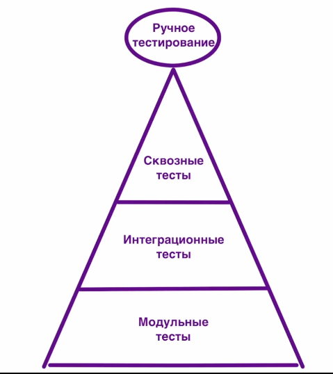

**Пирамида тестирования**

Модульное тестиорвание (Unit test) - это тесты, которые проверяют работу какого-то одного модуля, функции, то есть очень маленького компонента, который не связан с самим приложением.

Инреграционные тесты - это тесты, которые проверяют взаимодействие между модулями. Для них обычно нужна инфоструктура БД, например.

Сквозные тесты - это тесты, которые проверяют работу всего приложения в целом и проходят полностью весь путь от регистрации до оформления заказа, например. 

Параметризация тестов - это запуск одного и того же теста с различными наборами параметров. Это полезно, когда нужно проверить одну и ту же функциональность с разными входными данными. 